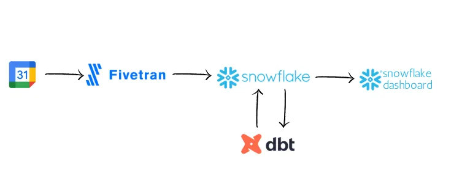

# fivetran-snowflake-dbt-project
## Архитектура проекта ##

## Стэк ##
### Генерирование данных — Google Календарь
Будем использовать данные которые накопились в Google Календарь
### Хранение данных — Snowflake
В качестве инструмента для хранения данных выберем Snowflake, облачное хранилище данных. Объем данных, с которыми мы будем иметь дело, сравнительно невелик, поэтому мы не будем задействовать расширенные возможностями Snowflake, обойдемся базовыми.
### Поглощение данных — Fivetran
Поглощение данных может быть организовано как с помощью Fivetran, так и с помощью Snowflake благодаря функции Partner Connect. Специально для синхронизации с Fivetran будет создана новая БД, а также хранилище для выполнения рабочих нагрузок SQL.
### Преобразование данных — dbt Core
Как только данные занесены в Snowflake (и по умолчанию автоматически синхронизируются каждые 6 часов), мы переходим к этапу трансформации с помощью dbt Core. dbt (инструмент для создания данных) значительно облегчает модулизацию SQL-запросов, позволяя повторно использовать и контролировать версии рабочих процессов SQL.
### Предоставление данных — Snowflake Dashboard
И, наконец, визуализируем преобразованные данные с помощью Snowflake Dashboards
